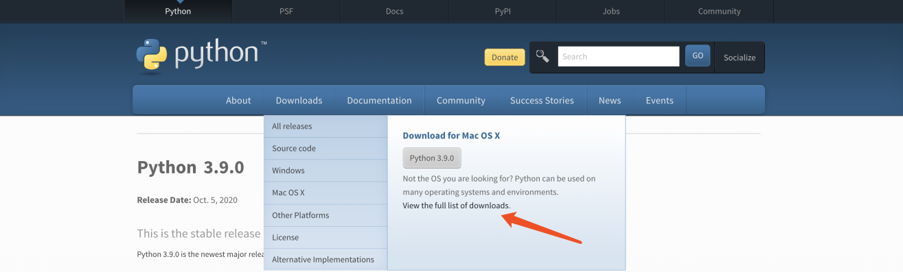
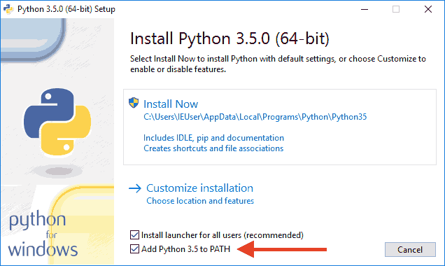

# 《GET开发的武器》Python环境搭建
## 1 内容包含
### 1.1 Python介绍

在Python的官网 www.python.org 中找到最新版本的Python安装包，点击进行下载，请注意，当你的电脑是32位的机器，请选择32位的安装包，如果是64位的，请选择64位的安装包


> - Windows
>  - Windows x86-64 web-based installer 是通过需要联网完成安装的文件
>  - Windows x86-64 executable installer 是可执行的安装文件，下载后，双击安装即可
>  - Windows x86-64 web-based installer 是可嵌入式的压缩包文件，可以集成到其他应用中
>- Linux
>  - Gzipped source tarball 编译安装
> 	- gcc、zilib
>  - XZ compressed source tarball
>- Mac
>  - macOS 64-bit installer 双击安装

### 1.2 Python安装

- 右键点击"计算机"，然后点击"属性"
- 然后点击"高级系统设置"
- 选择"系统变量"窗口下面的"Path",双击即可！
- 然后在"Path"行，添加python安装路径即可(我的D:\Python32)，所以在后面，添加该路径即可。 ps：记住，路径直接用分号"；"隔开！

- 最后设置成功以后，在cmd命令行，输入命令"python"，就可以有相关显示。


**测试**
1. 开始--运行--cmd
2. Python -V
3. 显示安装的版本即可

## 1.3 Python第一个程序
```python
print('Hello My Python!!')
```

## 1.4 Python交互方式
- 交互式
- 文件式

## 1.5 PythonIDE的配置与使用
### 1.5.1 DOS
> IDLE
### 1.5.2 IDE工具
> 文本工具

- NotePad++

- EditPlus++

- Sublime
> 集成工具

- PyCharm
- VSCode


## 1.6 Python的注释
> 作用： 用来给程序员看的，增强文件可读性来使用的

- 单行注释： `#`
- 多行注释： `'''`  、`"""`
## 练习
- Python不同版本的下载
- Python《产品介绍代码》实现