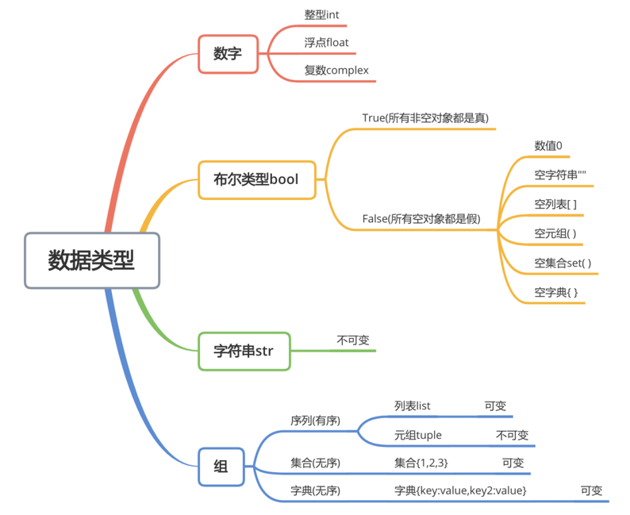
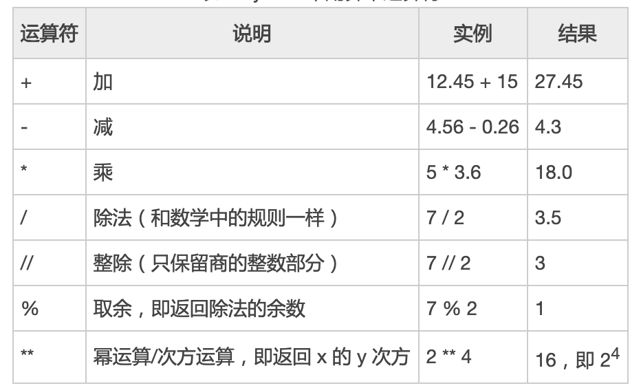
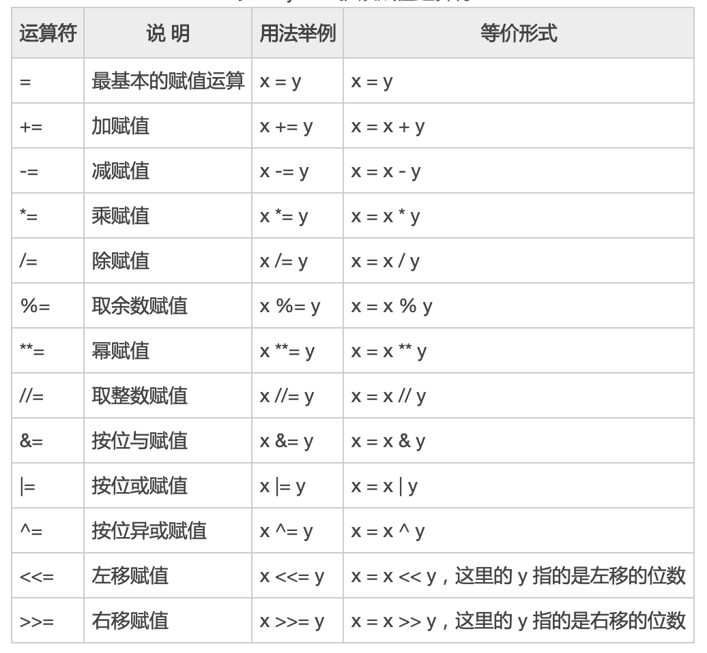
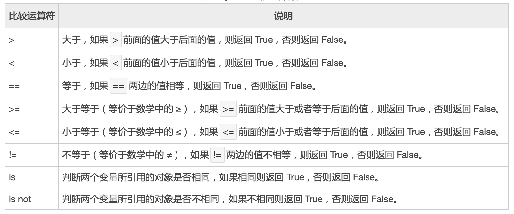
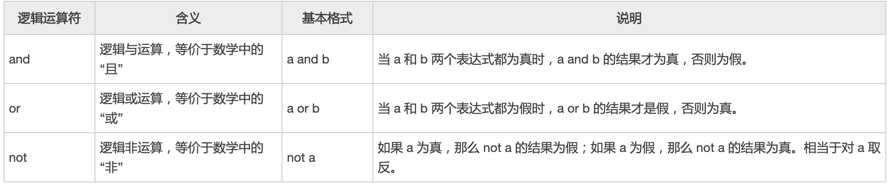

# 《进入IT的世界》Python数据类型
## 1 标识符与关键字

> 开发人员在程序中自定义的一些符号和名称 如变量名、函数名、类名

> 关键字是Python语言中一些已经被赋予特定意义的单词，这就要求开发者在开发程序时，不能用这些保留字作为标识符给变量、函数、类、模板以及其他对象命名

<table>
	<tr>
		<td>and</td>
		<td>as</td>
		<td>assert</td>
		<td>break</td>
		<td>class</td>
        <td>True</td>
	</tr>
	<tr>
		<td>continue</td>
		<td>def</td>
		<td>del</td>
		<td>elif</td>
		<td>else</td>
		<td>except</td>
	</tr>
	<tr>
		<td>finally</td>
		<td>for</td>
		<td>from</td>
		<td>False</td>
		<td>global</td>
		<td>if</td>
	</tr>
	<tr>
		<td>import</td>
		<td>in</td>
		<td>is</td>
		<td>lambda</td>
		<td>nonlocal</td>
		<td>not</td>
	</tr>
	<tr>
		<td>None</td>
		<td>or</td>
		<td>pass</td>
		<td>raise</td>
		<td>return</td>
		<td>try</td>
	</tr>
	<tr>
		<td>while</td>
		<td>with</td>
		<td>yield</td>
	</tr>
</table>

> 通过Python代码查看关键字

```python
import keyword
keyword.kwlist
```
## 2 变量的使用
### 2.1 规则
- 由 **字母(包括中文)** 、 **下划线** 和 **数字** 组成
- 且 **数字** 不能 **开头**
- 不能为 **系统关键字** 、**大小写** 敏感

### 2.2 技巧
- 见名知意: `max_value`
- 驼峰命名
  - 大驼峰
    - `UserName`
  - 小驼峰
    - `userName`
  - 下划线连接
    - `user_name`


### 2.3 常用的数据类型

实际开发中，我们经常需要使用数字记录游戏中用户的得分、游戏中角色的生命值、伤害值等信息，Python语言提供了数值类型用于保存这些数值

需要注意的是，Python 中这些数值类型都是不可改变的，也就是说，如果我们要修改数字类型变量的值，那么其底层实现的过程是，先将新值存放到内存中，然后修改变量让其指向新的内存地址，换句话说，Python 中修改数值类型变量的值，其实只是修改变量名所表示的内存空间

数值类型只是一个泛泛的统称，Python 中的数值类型主要包括整形、浮点型和复数类型

> 变量使用的注意事项:

定义变量的时候，而且它已经有数据的情况下，系统自动决定了它的类型 如果想查看变量的类型，可以使用 type(变量名)进行查看




数据类型转换
- `int(x,[,base])`	将x转换为一个整数
- `float(x)`	将x转换为一个浮点数
- `str(x)`	将x转换为字符串
- `repr(x)`	将对象x转换为表达式字符串
- `eval(str)`	用来计算在字符串中的有效python表达式，并返回一个对象
- `tuple(s)`	将序列s转换为一个元组
- `list(s)`	将序列s转换为一个列表
- `hex(x)`	将一个整数转换为一个十六进制的字符串
- `oct(x)`	将一个整数转换为一个八进制的字符串

## 3 运算符
### 3.1 算术运算符
> 算术运算符也即数学运算符，用来对数字进行数学运算，比如加减乘除。

> 下表列出了 Python 支持所有基本算术运算符。



### 3.2 赋值运算符

> 赋值运算符用来把右侧的值传递给左侧的变量（或者常量）；

> 可以直接将右侧的值交给左侧的变量，也可以进行某些运算后再交给左侧的变量，比如加减乘除、函数调用、逻辑运算等。



### 3.3 比较运算符

> 比较运算符，也称关系运算符，用于对常量、变量或表达式的结果进行大小比较。

> 如果这种比较是成立的，则返回 True（真），反之则返回 False（假）



### 3.4 逻辑运算符



