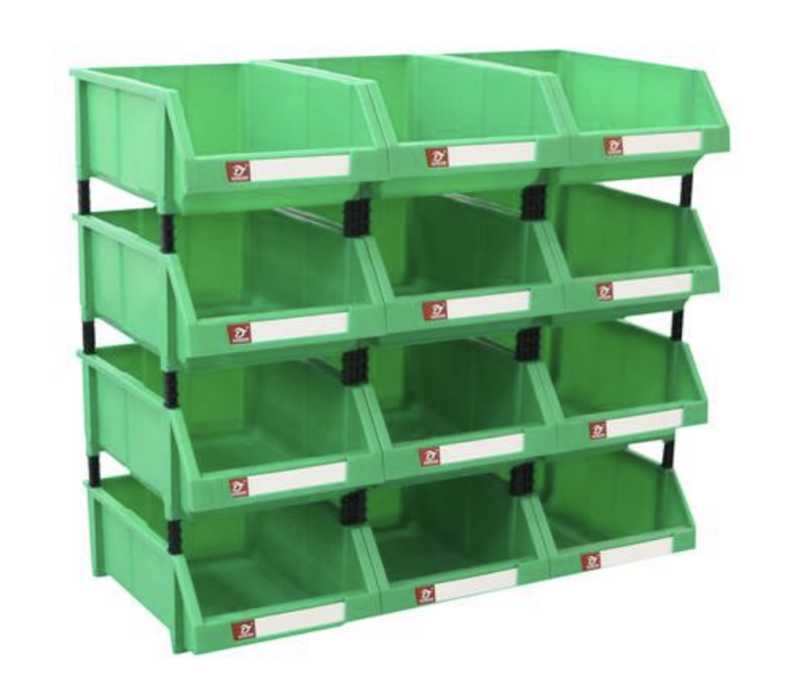

# 《数据的收纳袋》Python集合


## 1. 列表

> 序列是Python中最基本的数据结构。序列中的每个元素都分配一个数字 - 它的位置，或索引，第一个索引是0，第二个索引是1，依此类推

> 使用下标索引来访问列表中的值，同样你也可以使用方括号的形式截取字符



```python
list1 = ['sxt', 'bjsxt', 1997, 2000]
list2 = [1, 2, 3, 4, 5, 6, 7 ]
 
print ("list1[0]: ", list1[0])
print ("list2[1:5]: ", list2[1:5])
```

## 2. 元组
## 3. 字典