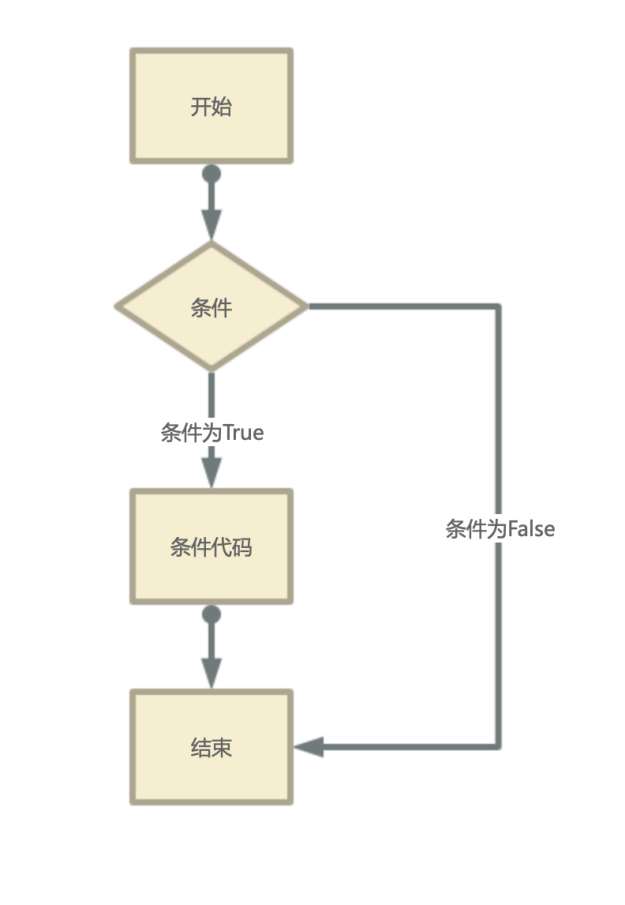
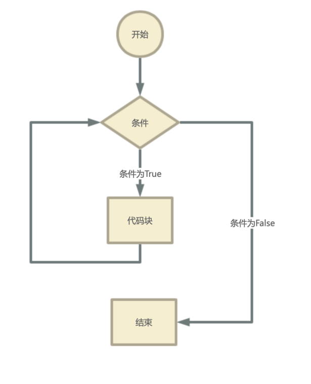
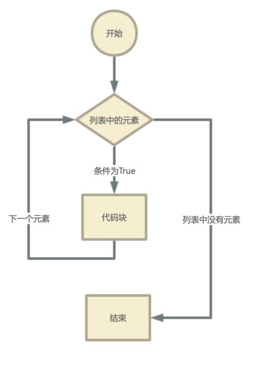

 # 《让机器人帮我们选择》流程控制

 ## 1. 选择结构
> Python条件语句是通过一条或多条语句的执行结果（True或者False）来决定执行的代码块。

可以通过下图来简单了解条件语句的执行过程:



### 1.1 单分支

```python
if 条件表达式：
    语句体
```

### 1.2  双分支

```python
if 条件表达式：
    语句体
else:
    语句体
```

### 1.3 多分支

```python
if 条件表达式1:
    执行语句1……
elif 条件表达式2:
    执行语句2……
elif 条件表达式3:
    执行语句3……
else:
    执行语句4……
```
### 1.4 购物案例


```python
skins = [
    {'id': 1, 'name': '青莲剑仙', 'level': '勇者', 'price': 588},
    {'id': 2, 'name': '凤凰求', 'level': '史诗', 'price': 2888},
    {'id': 3, 'name': '千年之狐', 'level': '史诗', 'price': 688},
    {'id': 4, 'name': '天狼绘梦者', 'level': 'KPL限定', 'price': 2888}
]

money = 1000

num = input('请输入要要购买的皮肤编号：(请输入数字)')     
if num.isdigit():
    num = int(num) - 1
    if not (num > len(skins) or num < 0):
        print(f'您选择的是：{skins[num].get("name")}   价格为：{skins[num].get("price")}')
        if skins[num].get('price') > money:
            print('金额不足，请充值！！')
        else:
            print(f'购买成功！！ 您的余额为：{money - skins[num].get("price")}')
    else:
        print('输入的值超出范围！！')
else:
    print('是不是看不懂汉语！！！！')

```


 ## 2. 循环结构

> 当我们在需要执行操作时，我们可以使用循环的语句
> Python 中的循环语句有 `for` 和 `while`。
> Python 循环语句的控制结构图如下所示：




### 2.1 while的使用

```python
n = 100
 
sum = 0
counter = 1
while counter <= n:
    sum = sum + counter
    counter += 1
 
print("1 到 %d 之和为: %d" % (n,sum))
```

### 2.2 for的使用

```python
for x in languages:
    print (x)
```

```python
for i,l in enumerate(list):
    pass
```

### 2.3 自动选餐系统


```python
data = [
    {'id':1,'name':'小吃','time':20},
    {'id':2,'name':'炒菜','time':40},
    {'id':3,'name':'牛排','time':50},
    {'id':4,'name':'汉堡','time':30},
]

for d  in data:
    print(f'您常吃的有：{d.get("name")}')

eat_time = int(input("您准备花费多少时间就餐: (分钟)"))

tmp_time = 0
for d in data:
    if d.get("time") <= eat_time and d.get("time") >= tmp_time:
        # print(f'可以吃 {d.get("name")}')
        tmp_time = d.get('time')

flag = True # 默认系统没有推荐方案
for d  in data:
    if d.get('time') == tmp_time:
        print(f'您好,系统给您推荐的是：{d.get("name")}')
        flag = False
        break
if flag:
    print('您好，系统没有可推荐的食物给您,建议去喝西北风！！！')
```